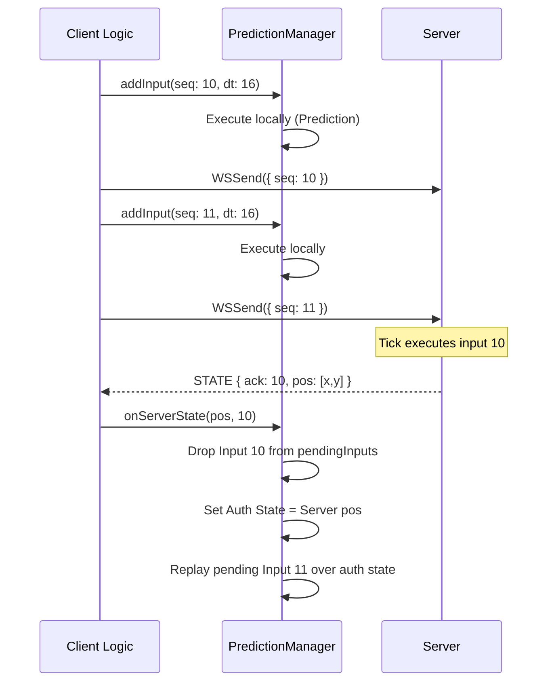

```mermaid
sequenceDiagram
    participant UI as Client Logic
    participant P as PredictionManager
    participant S as Server
    
    UI->>P: addInput(seq: 10, dt: 16)
    P->>P: Execute locally (Prediction)
    UI->>S: WSSend({ seq: 10 })
    
    UI->>P: addInput(seq: 11, dt: 16)
    P->>P: Execute locally
    UI->>S: WSSend({ seq: 11 })
    
    Note over S: Tick executes input 10
    S-->>UI: STATE { ack: 10, pos: [x,y] }
    
    UI->>P: onServerState(pos, 10)
    P->>P: Drop Input 10 from pendingInputs
    P->>P: Set Auth State = Server pos
    P->>P: Replay pending Input 11 over auth state
```
