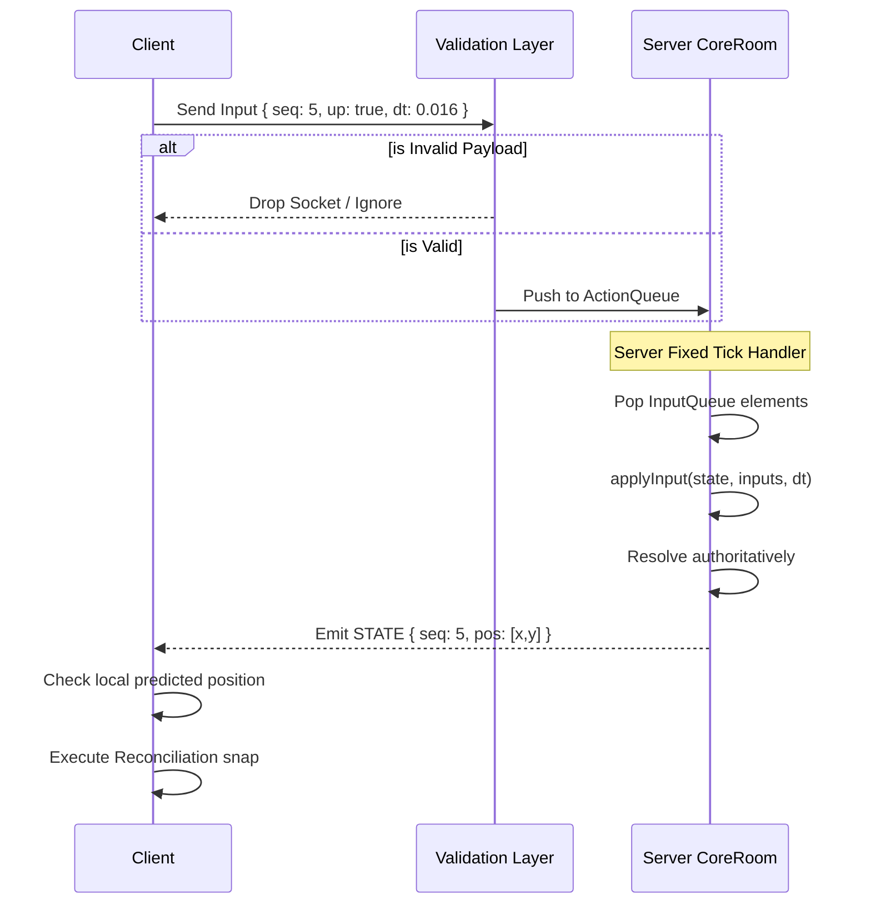

```mermaid
sequenceDiagram
    participant C as Client
    participant V as Validation Layer
    participant S as Server CoreRoom
    
    C->>V: Send Input { seq: 5, up: true, dt: 0.016 }
    alt is Invalid Payload
        V-->>C: Drop Socket / Ignore
    else is Valid
        V->>S: Push to ActionQueue
    end
    
    Note over S: Server Fixed Tick Handler
    S->>S: Pop InputQueue elements
    S->>S: applyInput(state, inputs, dt)
    S->>S: Resolve authoritatively
    S-->>C: Emit STATE { seq: 5, pos: [x,y] }
    
    C->>C: Check local predicted position
    C->>C: Execute Reconciliation snap 
```
