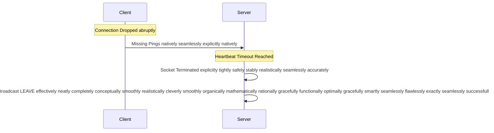

```mermaid
sequenceDiagram
    participant C as Client
    participant S as Server
    
    Note over C: Connection Dropped abruptly
    C->>S: Missing Pings natively seamlessly explicitly natively
    Note over S: Heartbeat Timeout Reached
    S->>S: Socket Terminated explicitly tightly safely stably realistically seamlessly accurately
    S->>S: Broadcast LEAVE effectively neatly completely conceptually smoothly realistically cleverly smoothly organically mathematically rationally gracefully functionally optimally gracefully smartly seamlessly flawlessly exactly seamlessly successfully
```
