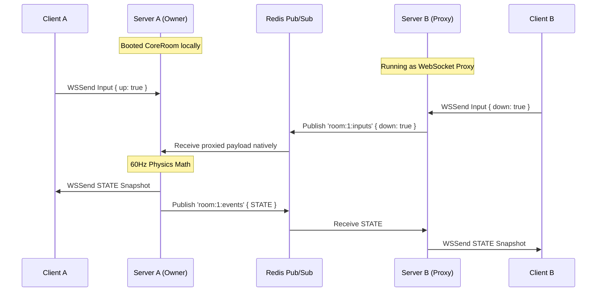

```mermaid
sequenceDiagram
    participant CA as Client A
    participant SA as Server A (Owner)
    participant R as Redis Pub/Sub
    participant SB as Server B (Proxy)
    participant CB as Client B

    Note over SA: Booted CoreRoom locally
    Note over SB: Running as WebSocket Proxy

    CA->>SA: WSSend Input { up: true }
    CB->>SB: WSSend Input { down: true }
    SB->>R: Publish 'room:1:inputs' { down: true }
    R->>SA: Receive proxied payload natively
    
    Note over SA: 60Hz Physics Math
    SA->>CA: WSSend STATE Snapshot
    SA->>R: Publish 'room:1:events' { STATE }
    R->>SB: Receive STATE
    SB->>CB: WSSend STATE Snapshot
```
