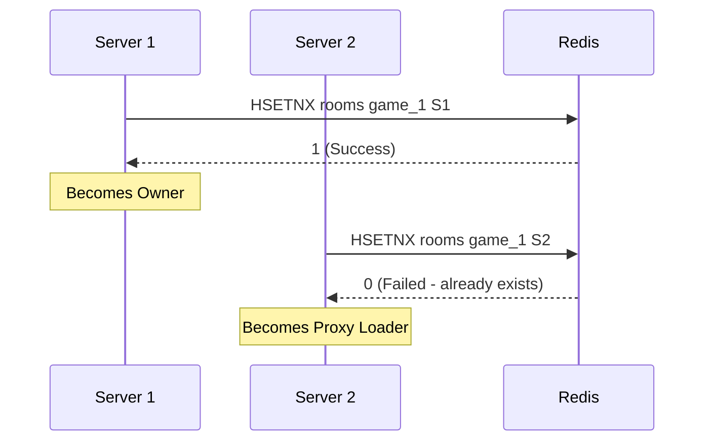

```mermaid
sequenceDiagram
    participant S1 as Server 1
    participant S2 as Server 2
    participant R as Redis

    S1->>R: HSETNX rooms game_1 S1
    R-->>S1: 1 (Success)
    Note over S1: Becomes Owner
    
    S2->>R: HSETNX rooms game_1 S2
    R-->>S2: 0 (Failed - already exists)
    Note over S2: Becomes Proxy Loader
```
