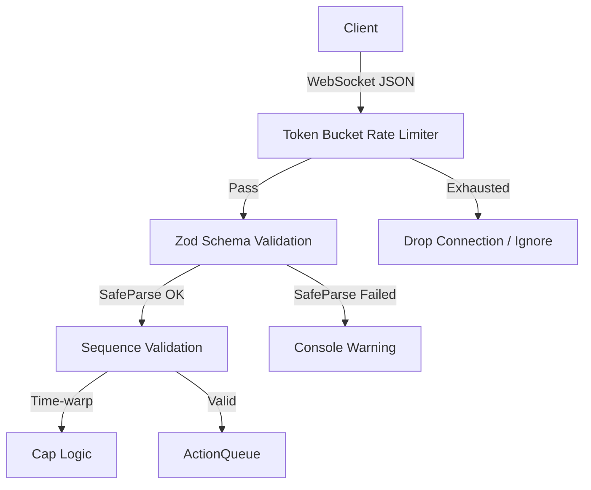

```mermaid
graph TD
    Client -->|WebSocket JSON| TokenBucket[Token Bucket Rate Limiter]
    TokenBucket -->|Pass| Zod[Zod Schema Validation]
    TokenBucket -->|Exhausted| Drop[Drop Connection / Ignore]
    Zod -->|SafeParse OK| Sequence[Sequence Validation]
    Zod -->|SafeParse Failed| Ignore[Console Warning]
    Sequence -->|Time-warp| Drop2[Cap Logic]
    Sequence -->|Valid| Queue[ActionQueue]
```
