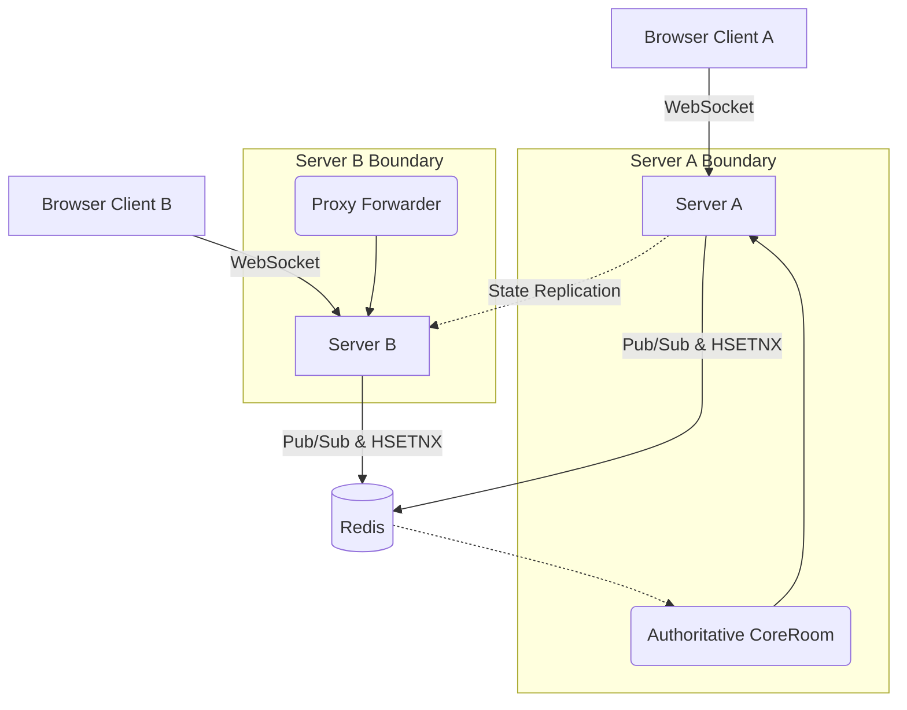

```mermaid
graph TD
    ClientA[Browser Client A] -->|WebSocket| NodeA[Server A]
    ClientB[Browser Client B] -->|WebSocket| NodeB[Server B]

    NodeA -->|Pub/Sub & HSETNX| Redis[(Redis)]
    NodeB -->|Pub/Sub & HSETNX| Redis

    subgraph Server A Boundary
        NodeA
        RoomAuthA(Authoritative CoreRoom) --> NodeA
    end

    subgraph Server B Boundary
        NodeB
        RoomProxyB(Proxy Forwarder) --> NodeB
    end

    NodeA -.->|State Replication| NodeB
    Redis -.-> RoomAuthA
```
